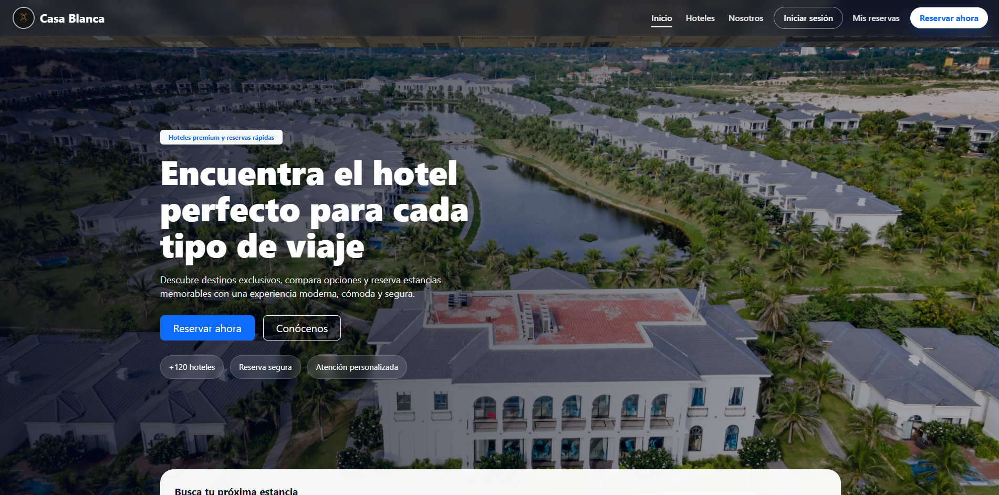
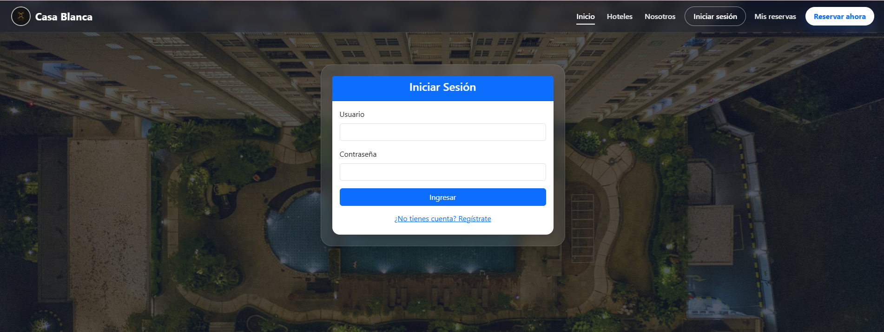
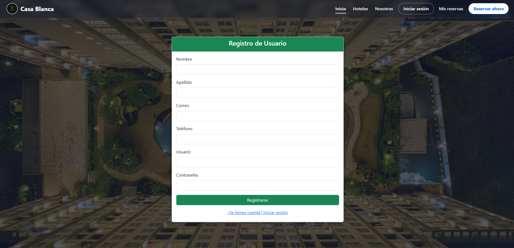
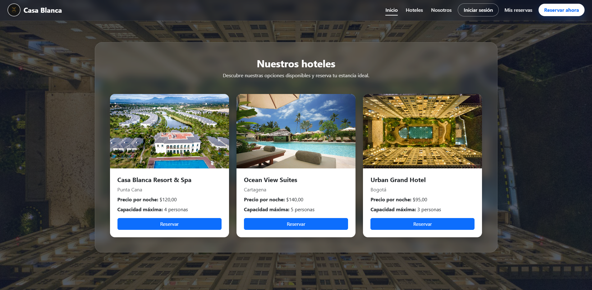
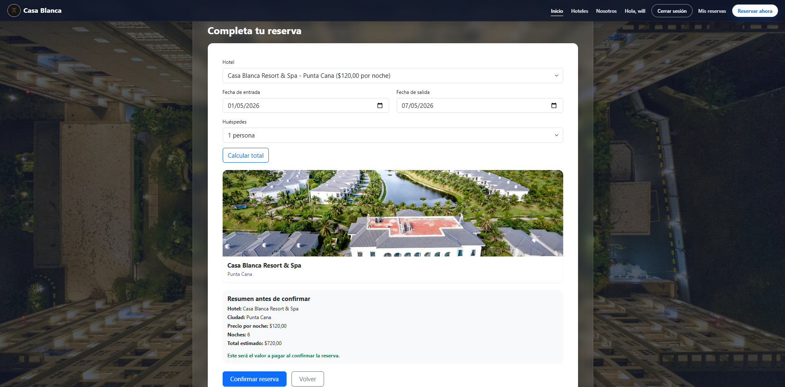
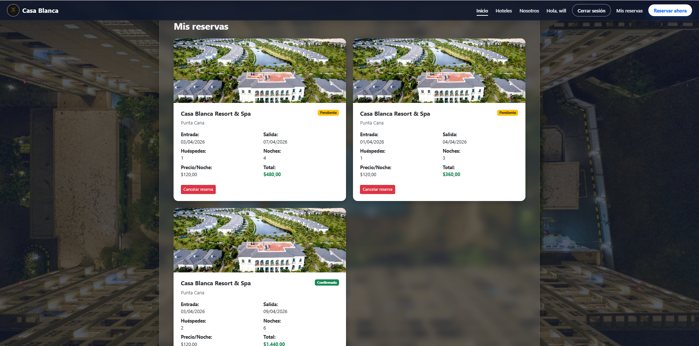
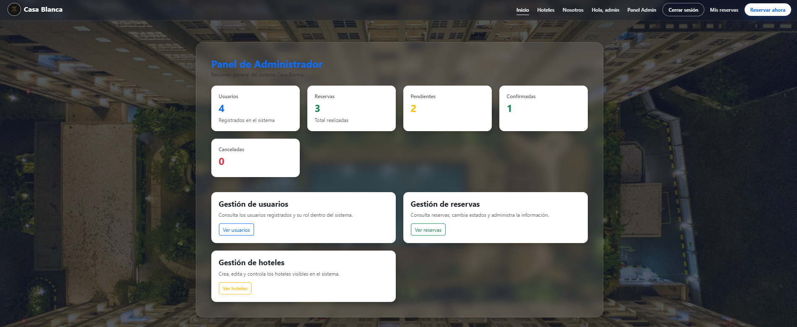
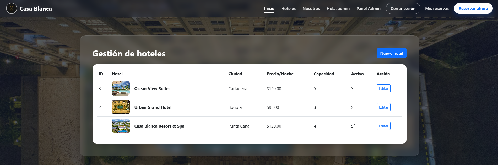

# Casa Blanca

Aplicacion web de reservas hoteleras desarrollada con ASP.NET MVC 5, C# y SQL Server. El proyecto permite registrar usuarios, iniciar sesion, consultar hoteles disponibles, crear reservas y administrar el catalogo de hoteles desde un panel administrativo.

## Demo del proyecto

Casa Blanca fue construida como una plataforma de reservas con enfoque academico y de portafolio. La solucion implementa una arquitectura MVC clasica, acceso a datos mediante clases DAO y una base de datos relacional en SQL Server.

### Funcionalidades principales

- Registro de usuarios con validaciones
- Inicio y cierre de sesion
- Catalogo de hoteles activos
- Creacion y consulta de reservas
- Cancelacion de reservas pendientes por parte del usuario
- Dashboard administrativo con metricas basicas
- Creacion y edicion de hoteles desde el panel admin

## Stack tecnologico

- ASP.NET MVC 5
- C#
- .NET Framework 4.7.2
- SQL Server
- ADO.NET
- Bootstrap 5

## Screenshots

### Home

### Login

### Register

### Hotels

### New Booking

### My Bookings

### Admin Dashboard

### Admin Hotels

## Estructura del repositorio

- `CasaBlanca.sln`: solucion principal
- `CasaBlanca/`: proyecto web ASP.NET MVC
- `CasaBlanca/docs/`: documentacion tecnica y material para portafolio

## Documentacion

- [Arquitectura](CasaBlanca/docs/architecture.md)
- [Base de datos](CasaBlanca/docs/database.md)
- [Notas para portafolio](CasaBlanca/docs/portfolio-notes.md)
- [Script SQL para el repositorio](CasaBlanca/docs/database/CasaBlanca.portfolio.sql)

## Como ejecutarlo en local

1. Abrir `CasaBlanca.sln` en Visual Studio
2. Restaurar paquetes NuGet
3. Ejecutar el script `CasaBlanca/docs/database/CasaBlanca.portfolio.sql` en SQL Server
4. Revisar la cadena de conexion en `CasaBlanca/Web.config`
5. Ejecutar el proyecto con IIS Express

## Credenciales de prueba

- Usuario: `admin`
- Clave: `admin123`

## Estado actual

El flujo principal esta funcional para portafolio y demo local: autenticacion, listado de hoteles, creacion de reservas y panel administrativo de hoteles. Ademas, el proyecto ya incluye documentacion separada para arquitectura y base de datos.

## Mejoras futuras

- Completar la administracion total de usuarios y reservas
- Mejorar la estrategia de autenticacion para un entorno productivo
- Incorporar pruebas automatizadas
- Preparar configuraciones por entorno para despliegue

